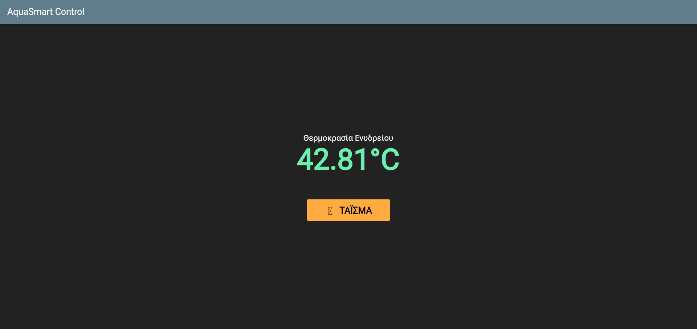
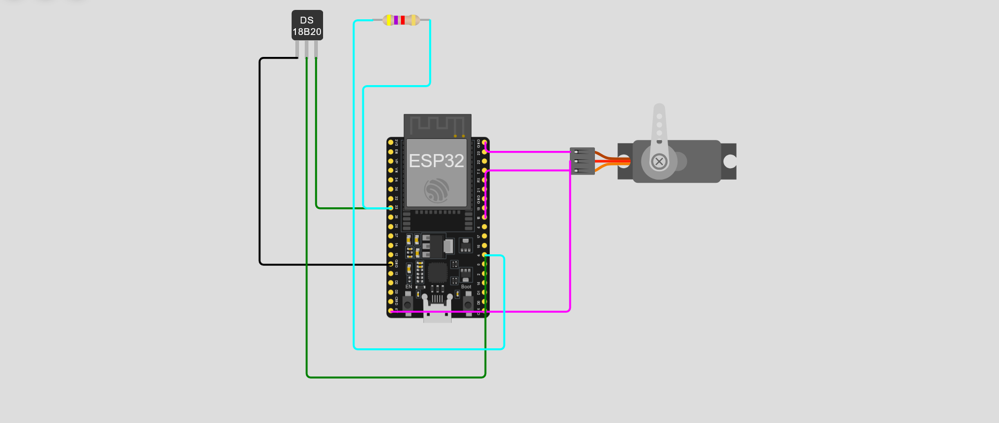
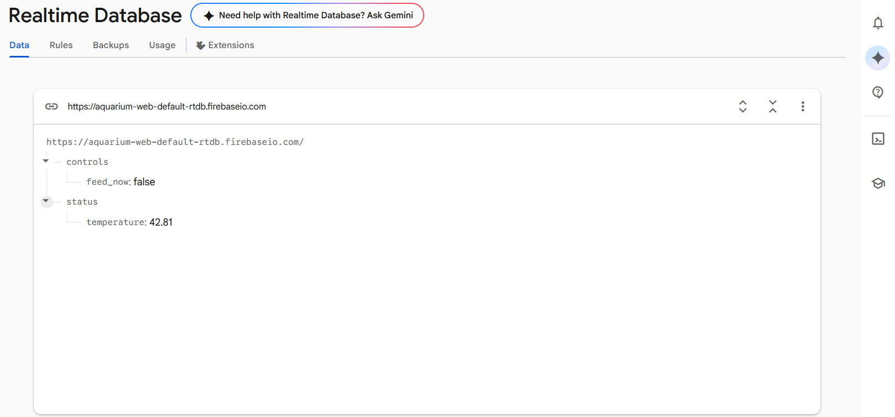

# 🐠 AquaSmart - Smart Aquarium IoT Monitor & Control

An end-to-end IoT project that enables real-time aquarium temperature monitoring and remote feeding control via a Flutter Web application integrated with Firebase Realtime Database.

## 🚀 Tech Stack & Architecture
* **Frontend:** Flutter (Web) - Dashboard displaying current temperature and manual feeding controls.
* **Backend:** Firebase Realtime Database - Acts as the real-time data bridge.
* **IoT Hardware:** ESP32 simulated in Wokwi, utilizing a DS18B20 temperature sensor and a Servo motor.

## 📸 System Screenshots

### 1. Web Dashboard (Flutter Application)


### 2. Hardware Circuit (Wokwi Simulator)


### 3. Realtime Database Cloud (Firebase)


## 📁 Project Structure
* `lib/main.dart`: Core Flutter app wiring up the Firebase stream.
* `iot_hardware/`: Contains the `sketch.ino` (C++ code running light HTTP Client PATCH/GET methods) and `diagram.json` (circuit wiring).
* `MyAquarium Design.docx`: Documentation detailing the baseline architecture.

## 🛠️ How to Run

### Hardware Simulation
1. Load the files from `iot_hardware/` into [Wokwi](https://wokwi.com).
2. Install `DallasTemperature`, `OneWire`, and `ESP32Servo` via the Library Manager.
3. Run the simulation to connect to the virtual `Wokwi-GUEST` network.

### Flutter Web Dashboard
1. Open the root folder in VS Code.
2. Spin up the local development server:
   ```bash
   flutter run -d chrome
